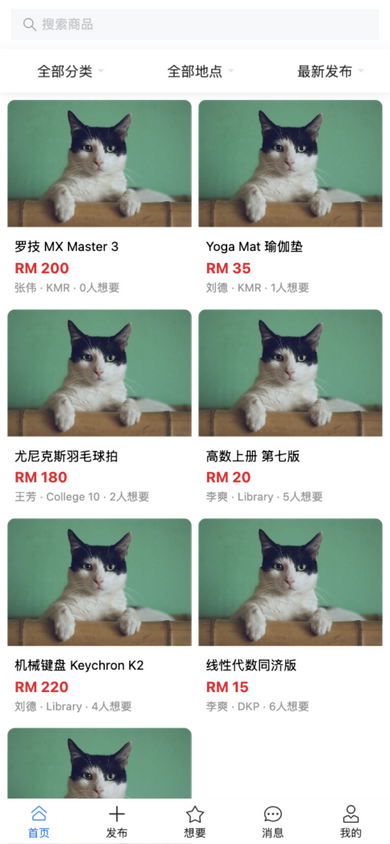
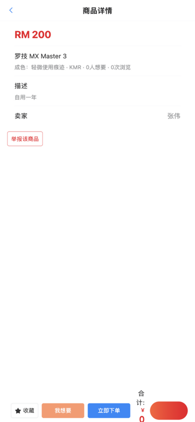
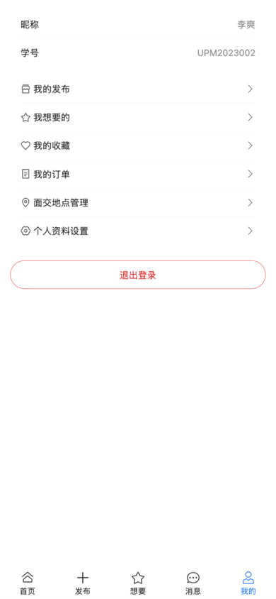
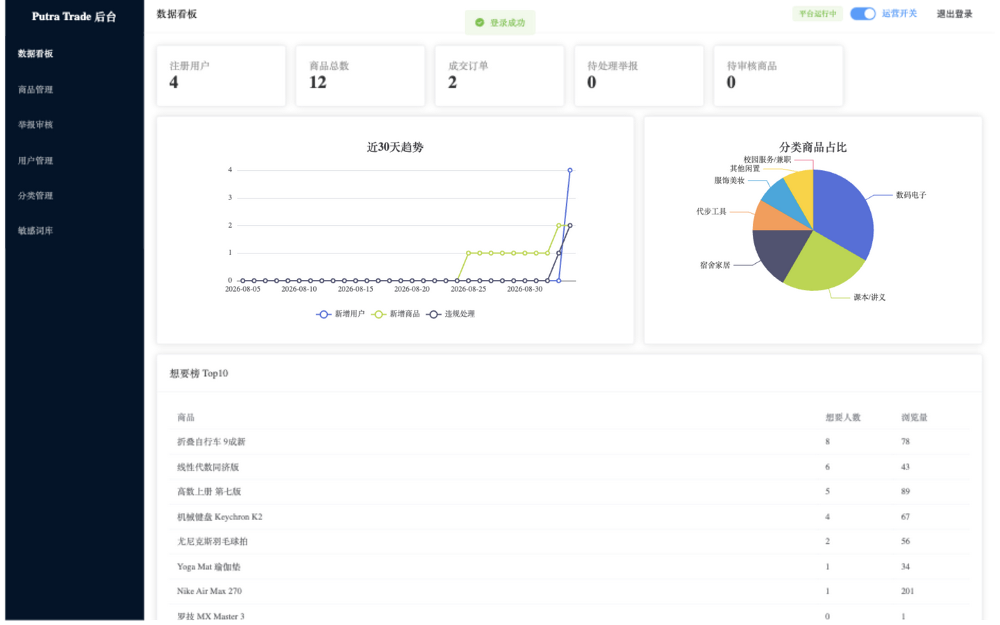
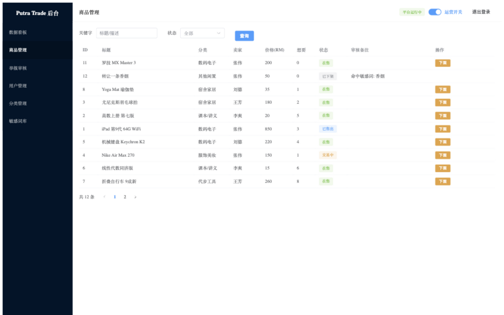

# Putra Trade · UPM 校园二手交易平台

> 面向马来西亚博特拉大学（UPM）学生的全栈校园二手交易平台。
> 卖家发布闲置 → 买家搜索/想要/私聊 → 下单面交完成交易；管理员审核内容、处理举报、数据看板运营。

     

## 在线体验（本机部署）

| 端 | 地址 | 技术 | 测试账号 |
|----|------|------|---------|
| 用户端 H5 | http://localhost:8000 | Vue 3 + Vant | BC210001 / 123456 |
| 管理后台 | http://localhost:8081 | Vue 3 + Element Plus + ECharts | admin / admin123 |
| API 文档 | http://localhost:8080/doc.html | Knife4j (OpenAPI 3) | — |

## 系统截图

| 用户端首页 | 商品详情 | 个人中心 |
|:---:|:---:|:---:|
|  |  |  |

| 管理端看板 | 商品审核 |
|:---:|:---:|
|  |  |

## 系统架构

```
┌───────────────┐     ┌───────────────┐
│  user-web H5  │     │  admin-web    │   Vue 3 + Vite
│  Vant         │     │  Element Plus │
└───────┬───────┘     └───────┬───────┘
        └───────── Nginx ─────┘   静态托管 · 反向代理 · WebSocket Upgrade
                    │
        ┌───────────▼────────────┐
        │   putra-trade-server   │  Spring Boot 2.7 · Maven 三模块
        │  ┌──────────────────┐  │  common: Result/ThreadLocal/JWT/BCrypt/DFA
        │  │ 40+ REST API     │  │  pojo:   Entity/DTO/VO
        │  │ JWT 双密钥认证    │  │  server: Controller/Service/Mapper
        │  └──────────────────┘  │
        └──┬──────┬──────┬─────┘
        MySQL 8  Redis  WebSocket
        13 张表  缓存    实时消息推送
```

## 核心功能

**用户端**：UPM 邮箱注册（校园身份门槛）· 商品发布/编辑/标记售出 · 关键字+分类+交货地点+排序组合搜索 · 收藏/想要（轻重意向分离）· 一对一站内私聊（WebSocket 实时）· 下单/模拟支付/面交确认 · 举报 · 个人中心

**管理端**：数据看板（30 天趋势/分类占比/想要榜）· 商品审核（敏感词命中队列）· 违规下架（理由通知卖家）· 举报处理（下架/禁止发布/禁止私聊/封号）· 用户封禁 · 分类管理 · 敏感词库 · POI 报表导出 · 平台运营开关

## 技术亮点（Design Decisions）

1. **JWT 双密钥认证体系**：用户端/管理端独立密钥与拦截器，Token 互不通用；ThreadLocal 传递登录态，请求结束自动清理防线程串号。
2. **内容安全两层防护**：发布时 DFA 字典树敏感词扫描（O(n)，词库内存常驻），命中不硬拒而是转入 `待审核` 状态进后台人工队列；叠加用户举报 → 审核闭环，不误伤正常商品。
3. **商品 5 态状态机**：在售 → 交易中 → 已售出 / 已下架 / 待审核，卖家一键"标记已售"停止打扰，买家在想要列表实时看到状态流转。
4. **want_count 的一致性权衡**：唯一索引防重复 + 单行原子 UPDATE + 同事务写入保证计数准确；刻意不引入 Redis 计数——在文档中论证了"什么规模才值得 Redis INCR + 异步回刷"。
5. **订单闭环与超时处理**：下单锁定商品（事务边界）→ 模拟支付 → 面交确认；Spring Task cron 每分钟扫描，30 分钟未支付自动取消并释放商品。
6. **多态举报表设计**：`target_type + target_id` 一张表装商品/用户两种举报，后台一套审核界面处理两类对象。
7. **轻/重意向分离建模**：收藏 = 轻意向（静默）；想要 = 重意向（解锁联系方式 + 实时通知卖家 + 热度计数）。
8. **WebSocket 推送 + 消息落库兜底**：在线实时收到聊天/通知，离线消息落库，上线后拉取历史，不丢消息。

## 快速开始

```bash
# 环境要求：JDK 17 · Maven 3.8+ · MySQL 8 · Redis · Node 18+

# 1. 初始化数据库（13 张表 + 种子数据）
mysql -u root -p < docs/sql/putra_trade.sql

# 2. 启动后端（Redis 密码见 application.yml）
cd putra-trade && mvn clean package -DskipTests
java -jar putra-trade-server/target/putra-trade-server-1.0.0.jar

# 3. 前端（开发模式）
cd user-web  && npm install && npm run dev   # :8082
cd admin-web && npm install && npm run dev   # :8081

# 4. 生产部署：前端 npm run build 后由 Nginx 托管
#    配置示例见 docs（Nginx 静态托管 + /user /admin /upload /ws 反代）
```

## 项目结构

```
├── putra-trade/          # 后端 Maven 三模块工程
│   ├── putra-trade-common/    # Result、ThreadLocal、JWT、BCrypt、DFA 过滤器
│   ├── putra-trade-pojo/      # Entity / DTO / VO
│   └── putra-trade-server/    # Controller / Service / Mapper / Task / WebSocket
├── user-web/             # 用户端 H5（Vue 3 + Vant，12 页面）
├── admin-web/            # 管理后台（Vue 3 + Element Plus + ECharts，7 页面）
├── docs/                 # 数据库设计（含 19 条设计决策）、接口文档、原型、SQL
└── gui-test-screenshots/ # GUI 冒烟测试证据截图
```

## 文档

- [数据库设计文档](docs/DATABASE_DESIGN.md) — 13 张表 + 每条设计决策的权衡（面试问答式）
- [项目路线图](UPM_MARKET_ROADMAP.md) — 从「苍穹外卖」课程翻译而来的功能映射表

## 路线图

- [x] 站内一对一聊天（WebSocket + 离线兜底）
- [ ] 商品全文搜索（MySQL LIKE → Elasticsearch）
- [ ] 买卖双方互评 + 信用分
- [ ] uni-app 移植微信小程序
- [ ] Docker Compose + 云服务器公网部署
